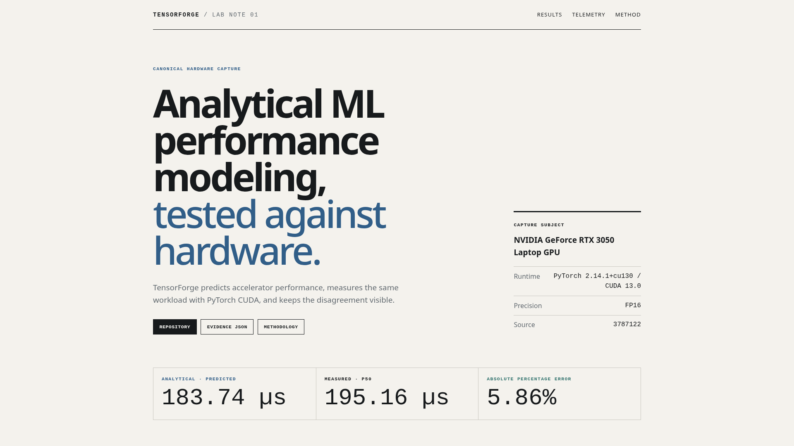

# TensorForge

TensorForge is an analytical ML-systems performance toolkit that models
accelerator workloads, then validates its predictions against measured
PyTorch/CUDA execution and GPU telemetry.

[Project showcase](https://nhatminh06.github.io/tensorforge/) ·
[Canonical RTX 3050 evidence](docs/evidence/canonical/README.md) ·
[Architecture](docs/architecture.md)

It makes workload arithmetic, PE-array mapping, SRAM feasibility, DRAM
traffic, and timing assumptions inspectable. It is not a cycle-accurate GPU
simulator or an MLOps platform.



## What TensorForge demonstrates

- Analytical models can make each performance assumption explicit instead of
  hiding everything behind one runtime number.
- A deterministic Core can be kept independent from the optional measurement
  and evidence stack around it.
- Empirical calibration lets a lower-bound model be compared honestly with
  physical execution.
- Disagreement is useful evidence: the strongest result and the clearest model
  boundary belong in the same report.
- Missing prerequisites should produce `NOT EVALUATED`, not a manufactured
  conclusion.

TensorForge models GEMM, Transformer, and materialized-im2col Conv2D/CNN
workloads. It supports rectangular PE-array mapping, SRAM-constrained tiling,
three explicit residency schedules, analytical timing, bounded design-space
exploration, and deterministic JSON experiments.

## Real RTX 3050 validation

The canonical capture used an NVIDIA GeForce RTX 3050 Laptop GPU, PyTorch
2.14.1+cu130, CUDA 13.0, FP16, 10 warmups, and 50 measured iterations.

| Workload | Predicted | Measured p50 | Measured p95 | APE | Measured / predicted |
|---|---:|---:|---:|---:|---:|
| `gemm_large_square` | 183.74 µs | 195.16 µs | 225.12 µs | 5.86% | 1.0622× |
| `gemm_tiny` | 0.544 µs | 12.28 µs | 13.79 µs | 95.57% | 22.58× |

The large workload tracks the calibrated lower bound closely, while the tiny
workload exposes a major model boundary. Fixed framework or kernel-launch
overhead is a plausible explanation for the latter result, but this capture
does not establish that explanation as causal.

The primary workload's `compute-bound` label is an analytical prediction, not
a measured bottleneck claim.

Calibration measured empirical ceilings of **11.687860 TFLOP/s** and
**180.748794 GB/s** on this device. They are probe-derived rates, not vendor
specifications or theoretical peaks.

## Architecture

```text
TensorForge Core
  workload → FLOPs + traffic → mapping + tiling → analytical result

tensorforge_ops → tensorforge

TensorForge Ops
  benchmark → calibration → validation → regression
            → telemetry → right-sizing → impact
```

The dependency direction is strictly `tensorforge_ops → tensorforge`, never
the reverse. Core has no dependency on PyTorch, MLflow, NVML, or Ops and remains
usable as a standalone analytical package.

See the [Core architecture](docs/architecture.md) and
[Ops architecture](docs/ops/README.md) for the implementation map.

## How the model works

For each normalized GEMM, TensorForge derives operation counts and tensor
traffic, maps the work onto a rectangular PE array, checks SRAM feasibility,
and evaluates tiling and loop-residency choices. Timing is then bounded by:

```text
compute time = mapped compute cycles / PE clock
memory time  = modeled DRAM bytes / effective bandwidth
lower bound  = max(compute time, memory time)
```

Core also reports serialized and perfect-overlap timing bounds. Transformer
blocks and CNN workloads are decomposed into ordered GEMMs and evaluated on one
fixed array; their operation times are summed without claiming cross-operation
fusion or SRAM residency.

The search covers a bounded, user-supplied Cartesian product of tiles,
schedules, and PE-array shapes. A result is the best searched candidate, never
a claim of global optimality. Formula details live in
[timing](docs/timing.md), [tiling](docs/tiling.md), and
[schedules](docs/schedules.md).

## TensorForge Ops

Ops surrounds a deterministic Core result with real measurement and explicit
evidence boundaries:

- **Benchmarking** runs the corresponding workload with PyTorch/CUDA and
  records latency, throughput, and CUDA memory.
- **Calibration** measures device-specific compute and memory-copy ceilings.
- **Validation** compares predicted and measured latency without tuning a
  workload-specific fudge factor.
- **Regression policy** gates only on comparable measured evidence.
- **Telemetry** records NVML diagnostics in a separate execution phase.
- **Right-sizing and impact** run only when their prerequisites exist.

The showcase uses five labels consistently:

| Label | Meaning |
|---|---|
| `PREDICTED` | Analytical Core output |
| `MEASURED` | Physical PyTorch/CUDA execution |
| `CALIBRATED` | Empirical device probe result |
| `DIAGNOSTIC` | Separate NVML telemetry context |
| `POLICY` | A decision derived only when its required evidence exists |

The canonical capture deliberately leaves these outcomes incomplete:

| Stage | Status | Reason |
|---|---|---|
| Regression | `NOT EVALUATED` | No defensible performance-changing historical baseline |
| Right-sizing | `OMITTED` | Only one physical device was measured |
| Impact | `NOT EVALUATED` | A measured regression result is required |

This is evidence discipline, not a hidden pass or failure. The capture fails
closed when required hardware is unavailable. A historical performance
baseline is optional; if no defensible baseline exists, measurement and
validation proceed while regression and impact remain explicitly unevaluated.

## Quick start

Core requires Python 3.11 or newer:

```bash
python -m venv .venv
source .venv/bin/activate
pip install -e .
pytest -q

python -m tensorforge --workload-preset gemm_tiny \
  --accelerator-preset balanced \
  --tile-m-values 32,64,128 \
  --tile-n-values 32,64,128 \
  --tile-k-values 32,64,128
```

Install optional Ops dependencies only for the workflows that need them:

```bash
pip install -e '.[ops,benchmark,telemetry]'
python tools/demo/summarize.py docs/evidence/canonical
python tools/demo/validate.py docs/evidence/canonical
```

The committed canonical bundle is the portfolio evidence. Its capture process
requires CUDA and NVML and never silently falls back to CPU. See the
[capture guide](tools/demo/README.md) before attempting a new capture.

## Evidence and verification

The canonical evidence bundle is committed under
[`docs/evidence/canonical`](docs/evidence/canonical/README.md). Its manifest
records the device, runtime, workload roles, capture source revision, and
policy state. `SHA256SUMS` covers 13 artifacts.

TensorForge Core is validated with analytical invariants, independently
derived known-value checks, and scaling-law tests. TensorForge Ops separately
validates predictions against measured PyTorch/CUDA execution. The repository
test suite covers Core models, Ops evidence tooling, regression policy,
telemetry, and canonical capture orchestration.

Useful verification commands:

```bash
pytest -q
pytest -q tests/test_demo_tools.py
bash scripts/validate.sh
python tools/demo/validate.py docs/evidence/canonical
git diff --check
```

The GitHub Pages showcase reads the committed JSON artifacts rather than
duplicating their numeric values in JavaScript.

## Limits of claim

TensorForge Core's generic accelerator model is not a silicon-validated,
cycle-accurate representation of the RTX 3050. TensorForge Ops compares Core
predictions against real PyTorch/CUDA measurements; the existence of that
measurement does not make the architecture model silicon accurate.

The canonical result covers one physical laptop GPU and one capture session.
Laptop thermal and power state can affect measurements. The 35 NVML samples
are diagnostic context from a separate run; they do not prove the analytical
bottleneck, and the observed `SwPowerCap` event does not prove the workload was
power-limited. The evidence does not establish production capacity, model
quality, business value, or generalization to every RTX 3050 Laptop GPU.

Additional model boundaries include one global SRAM, bandwidth-only DRAM
timing, fixed residency schedules, no power/energy or area model, no softmax,
normalization, activation, pooling, residual, or fusion timing, and only
materialized-im2col convolution. See [all limitations](docs/limitations.md).

## Documentation

- [Architecture](docs/architecture.md)
- [Core model and validation](docs/model.md) · [validation](docs/validation.md)
- [Memory](docs/memory.md) · [tiling](docs/tiling.md) ·
  [schedules](docs/schedules.md) · [timing](docs/timing.md)
- [Transformer](docs/transformer.md) · [convolution](docs/convolution.md)
- [Design-space exploration](docs/exploration.md) ·
  [reproducible experiments](docs/experiments.md)
- [TensorForge Ops](docs/ops/README.md)
- [Canonical capture methodology](tools/demo/README.md)
- [Recording guide](docs/recording.md)
- [Complete limitations](docs/limitations.md)

## Project status

TensorForge is feature-frozen for portfolio purposes. Future changes are
limited to bug fixes, compatibility fixes, documentation corrections, and
evidence replacement after a meaningful methodology or implementation change.
